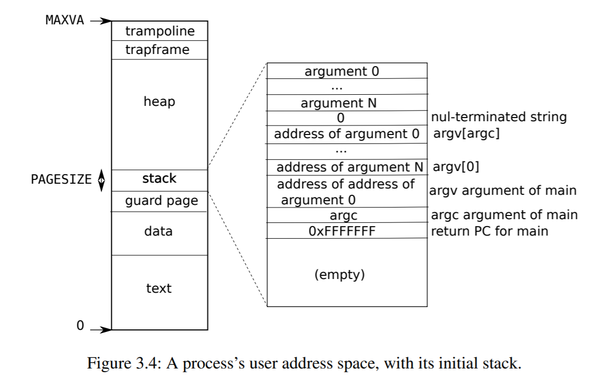
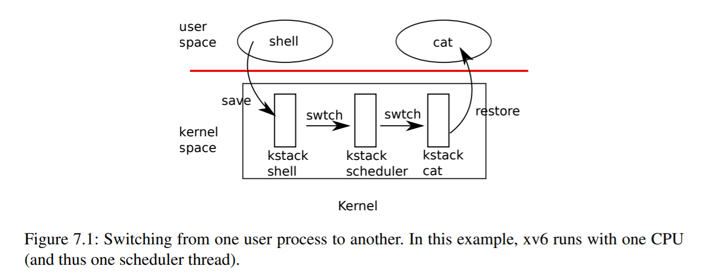

# Lab 5: Process Management and System Call

## 习题解答

### 1. 进程管理

#### 1.1 关于 PCB 设计

> 在 proc（即 PCB）中仅存储了进程的 trapframe 与 context 的指针，请说明 trapframe 与 context 的实例存在何处，为什么要这样设计？



本图引自 *xv6: a simple, Unix-like teaching operating system* [^1]。

如图所示，trapframe 的实例存在进程的用户地址空间（user address space）。为什么 PCB 中仅存储 trapframe 的指针？因为 trapframe 是一个保存了所有通用寄存器和一些特殊寄存器的结构。一方面，trap 时需要用到 trapframe 中的数据，所以它应当以某种形式存储在 PCB 中；另一方面，trap 时我们只能传入 trapframe 指针，因为硬件没有提供足够多的寄存器来在 trap 时传入整个 trapframe 结构。因此，在 PCB 中仅存储 trapframe 指针是一个节省空间的方案，trap 时只需一个寄存器用于传入 trapframe 指针即可 [^1]。



本图引自 *xv6: a simple, Unix-like teaching operating system* [^1]。

context 的实例存在执行 context switch 的内核所对应的 kernel stack 处。与 trapframe 类似，context 也是一个保存了一组通用寄存器的结构。scheduler 在 context switch 时需要交换进程的 context，然而我们并没有这么多寄存器来在函数调用时传入整个 context 结构。因此，我们在 PCB 中仅存储 context 的指针，这样在调度时 scheduler 就只需用到两个寄存器，分别存放了将被调入和调出的新旧进程的 context 指针 [^1]。

#### 1.2 Context switch

> 请完成 `inc/proc.h` 中 `struct context` 的定义以及 `kern/swtch.S` 中 context switch 的实现。

##### 1.2.1 Context 设计：`struct context`

context 中需要保存所有的 callee-saved 寄存器 [^1]，根据 ARM 开发文档 [^2]，即通用寄存器 X19 ~ X28。此外，我们额外保存寄存器 X29 (Frame Pointer) 和 X30 (Procedure Link Register)，其中 X30 用于指定用户进程初次运行的地址。

```c {.line-numbers}
// inc/proc.h

struct context {
    // Callee-saved Registers
    uint64_t x19;
    uint64_t x20;
    uint64_t x21;
    uint64_t x22;
    uint64_t x23;
    uint64_t x24;
    uint64_t x25;
    uint64_t x26;
    uint64_t x27;
    uint64_t x28;

    uint64_t x29;  // Frame Pointer
    uint64_t x30;  // Procedure Link Register
};
```

##### 1.2.2 Context switch 实现

context switch 主要做了以下几件事情 [^3]：

1. 将当前（将被调出的）旧进程的 callee-saved 寄存器压栈
2. 将当前栈指针的地址保存在 `*old`（其中 `old` 是函数调用传入的第一个参数，位于寄存器 X0），构建旧进程的 context
3. 将 `new`（即函数调用传入的第二个参数，位于寄存器 X1）的值覆盖当前栈指针的地址，切换到（将被调入的）新进程的 context
4. 将新进程的 callee-saved 寄存器弹栈，函数 `swtch` 返回（`ret`，等价于 `mov pc, x30`）

```armasm {.line-numbers}
# kern/swtch.S

/*
 * Context switch
 *
 *   void swtch(struct context **old, struct context *new);
 *
 * Save current register context on the stack,
 * creating a struct context, and save its address in *old.
 * Switch stacks to new and pop previously-saved registers.
 */
.global swtch

swtch:
    # Save old callee-saved registers
    stp x29, x30, [sp, #-16]!
    stp x27, x28, [sp, #-16]!
    stp x25, x26, [sp, #-16]!
    stp x23, x24, [sp, #-16]!
    stp x21, x22, [sp, #-16]!
    stp x19, x20, [sp, #-16]!

    # Switch stacks
    mov x19, sp
    str x19, [x0]
    mov sp, x1

    # Load new callee-saved registers
    ldp x19, x20, [sp], #16
    ldp x21, x22, [sp], #16
    ldp x23, x24, [sp], #16
    ldp x25, x26, [sp], #16
    ldp x27, x28, [sp], #16
    ldp x29, x30, [sp], #16

    ret
```

#### 1.3 关于 Context switch 设计

##### 1.3.1

> 在 `kern/proc.c` 中将 `swtch` 声明为 `void swtch(struct context**, struct context*)`，请说明为什么要这样设计？

因为如果第一个参数传的是 `struct context*`，那么在函数 `swtch` 中对第一个参数值的修改（也就是将栈指针的地址保存在寄存器 X0）将无法反映到函数外部。即在函数返回后，这个局部变量就会失效，这样也就无法保存旧进程的 context 指针。而传入 `struct context**`，就可以通过修改这个指针所指向的地址，来将旧进程的 context 地址传给函数外部。

##### 1.3.2

> `context` 中仅需要存储 callee-saved registers，请结合 PCS 说明为什么？

因为根据 PCS (Procedure Call Standard) [^2]，函数调用时，callee 只需要确保约定的 callee-saved 寄存器中的数据不被损坏（corrupt），而其他寄存器中的数据是可以损坏的。因此在 context switch 中，context 不需要存储 callee-saved 寄存器以外的其他寄存器，因为即使这些数据在 context switch 的过程中被损坏了也没有关系。context 只需保护 callee-saved 寄存器中的数据不受 context switch 影响即可。

##### 1.3.3

> 与 trapframe 对比，请说明为什么 trapframe 需要存储这么多信息？

因为 trap 过程不是函数调用，没有 caller 和 callee 的说法，不遵循也无法遵循 PCS 规范。例如系统中断时，内核可以直接中断用户程序，用户程序并不会有机会提前保存所谓的 caller-saved 寄存器，但这些数据同样是不应在 trap 后被内核程序损坏的。因此 trapframe 需要存储所有通用寄存器，才能保证之后回到用户态时可以正确还原用户程序的数据。

##### 1.3.4

> trapframe **似乎**已经包含了 context 中的内容，为什么上下文切换时还需要先 trap 再 switch？

因为 trap 过程是从用户态切换到内核态的过程，switch 过程是内核态中的过程。上下文切换需要在内核态中进行，因此还是要先 trap 再 switch。虽然 trapframe 似乎包含了 context 中的内容，但它们完全是两个不同的东西，有着不同的用途，保存在不同的位置，因此也无法复用其中的数据。

#### 1.4 内核进程管理模块

> 请根据 `kern/proc.c` 中相应代码的注释完成内核进程管理模块以支持调度第一个用户进程 `user/initcode.S`。

##### 1.4.1 PCB 设计：`struct proc`

每个用户进程的 PCB 中保存了以下数据，具体作用参见注释 [^4]：

```c {.line-numbers}
// inc/proc.h

struct proc {
    struct spinlock lock;

    // p->lock must be held when using these:
    enum procstate state;  // Process state
    void* chan;            // If non-zero, sleeping on chan
    int killed;            // If non-zero, have been killed
    int xstate;            // Exit status to be returned to parent's wait
    int pid;               // Process ID

    // wait_lock must be held when using these:
    struct proc* parent;  // Parent process

    // no lock needs to be held when using these:
    char* kstack;             // Bottom of kernel stack for this process
    uint64_t sz;              // Size of process memory (bytes)
    uint64_t* pgdir;          // Page table
    struct trapframe* tf;     // Trapframe for current syscall
    struct context* context;  // swtch() here to run process
    char name[16];            // Process name (debugging)
};
```

##### 1.4.2 锁的初始化：`proc_init`

函数 `proc_init` 的主要工作是完成 `ptable` 锁的初始化，以处理多核的并发问题。这里我们不是在整个 `struct ptable` 中，而是选择在每个 `struct proc` 中新增一个自旋锁 `proc_lock`。这样做的目的是为了使锁的控制粒度更细，实际上这也是 Xv6 for RISC-V [^4] 的实现方法。

在获取进程 `pid` 时，同样也存在并发问题，因此这里也为 `pid` 新增了一个自旋锁 `pid_lock`。自旋锁 `wait_lock` 则是为了确保父进程在子进程返回前维持等待状态，防止子进程 `p` 在访问父进程 `p->parent` 时发现父进程已丢失。

```c {.line-numbers}
// kern/proc.c

/*
 * Initialize the spinlock for ptable to serialize the access to ptable
 */
void
proc_init()
{
    initlock(&wait_lock, "wait_lock");
    initlock(&pid_lock, "pid_lock");
    for (struct proc* p = ptable.proc; p < &ptable.proc[NPROC]; ++p) {
        initlock(&p->lock, "proc_lock");
    }
    cprintf("proc_init: success.\n");
}
```

##### 1.4.3 创建新进程：`proc_alloc`

函数 `proc_alloc` 的主要工作是遍历进程表 `ptable`，找到一个 UNUSED 进程，进行内核部分的初始化工作，最后返回进程的 `proc` 指针。具体来说：

1. 利用函数 `pid_next` (`kern/proc.c`) 分配 PID
2. 利用函数 `kalloc` (`kern/kalloc.c`) 分配内核栈 kstack
3. 在 kstack 的栈顶分配一块空间作为 trapframe
4. 在 trapframe 下面再分配一块空间作为 context，并进行初始化；其中寄存器 X30 保存函数 `forkret` 的地址，作为进程初次从函数 `swtch` 返回时的返回地址；这里函数 `forkret` 只需在进程第一次被 `scheduler` 调度时进入一次，之后就不再需要进入了，关于调度时所有函数调用的过程还会在 1.4.5 节细讲
5. 设置进程状态为 EMBRYO

如果创建进程失败，则返回 `NULL`。

```c {.line-numbers}
// kern/proc.c

/*
 * Look through the process table for an UNUSED proc.
 * If found, change state to EMBRYO and initialize
 * state required to run in the kernel.
 * Otherwise return 0.
 */
static struct proc*
proc_alloc()
{
    for (struct proc* p = ptable.proc; p < &ptable.proc[NPROC]; ++p) {
        acquire(&p->lock);
        if (p->state != UNUSED) {
            release(&p->lock);
            continue;
        }

        p->pid = pid_next();

        // Allocate kernel stack.
        if (!(p->kstack = kalloc())) {
            proc_free(p);
            release(&p->lock);
            return NULL;
        }
        char* sp = p->kstack + KSTACKSIZE;

        // Leave room for trapframe.
        sp -= sizeof(*p->tf);
        p->tf = (struct trapframe*)sp;

        // Set up new context to start executing at forkret.
        sp -= sizeof(*p->context);
        p->context = (struct context*)sp;
        memset(p->context, 0, sizeof(*p->context));
        p->context->x30 = (uint64_t)forkret;

        p->state = EMBRYO;
        cprintf("proc_alloc: proc %d success.\n", p->pid);
        return p;
    }
    return NULL;
}
```

其中，函数 `proc_free` 的作用是清空进程的 PCB，并利用函数 `kfree` 和 `vm_free` 释放申请的内存。

```c {.line-numbers}
// kern/proc.c

/*
 * Free a proc structure and the data hanging from it,
 * including user pages.
 * p->lock must be held.
 */
static void
proc_free(struct proc* p)
{
    p->chan = NULL;
    p->killed = 0;
    p->xstate = 0;
    p->pid = 0;
    p->parent = NULL;
    if (p->kstack) kfree(p->kstack);
    p->kstack = NULL;
    p->sz = 0;
    if (p->pgdir) vm_free(p->pgdir, 4);
    p->pgdir = NULL;
    p->tf = NULL;
    p->name[0] = '\0';
    p->state = UNUSED;
}
```

##### 1.4.4 初始化用户进程：`user_init`

函数 `user_init` 的主要工作是初始化第一个用户进程。具体来说：

1. 利用函数 `proc_alloc` (`kern/proc.c`) 进行内核部分的初始化
2. 利用函数 `pgdir_init` (`kern/vm.c`) 分配一个用户页表，并指定进程的内存空间为一个页表的大小 `PGSIZE`
3. 利用函数 `uvm_init` (`kern/vm.c`) 将初始化二进制码 `initcode` 加载到页表的起始位置
4. 清空 trapframe，并进行初始化；其中寄存器 SP_EL0 设置为 `PGSIZE`，其余寄存器设置为 `0`；部分寄存器会在函数 `trapret` 返回（`eret`）时用到，之后会在 1.4.5 节细讲
5. 设置进程名为 `initproc`
6. 设置进程状态为 RUNNABLE

需要注意的是，函数 `user_init` 只需在 CPU0 中执行一次，而无需在其他 CPU 上执行（在这个坑上我花了 3 个多小时调试 orz）。

```c {.line-numbers}
// kern/proc.c

/*
 * Set up first user process (only used once).
 * Set trapframe for the new process to run
 * from the beginning of the user process determined
 * by uvm_init
 */
void
user_init()
{
    extern char _binary_obj_user_initcode_start[];
    extern char _binary_obj_user_initcode_size[];

    struct proc* p = proc_alloc();
    if (!p) panic("\tuser_init: process failed to allocate.\n");
    initproc = p;

    // Allocate a user page table.
    if (!(p->pgdir = pgdir_init()))
        panic("\tuser_init: page table failed to allocate.\n");
    p->sz = PGSIZE;

    // Copy initcode into the page table.
    uvm_init(
        p->pgdir, _binary_obj_user_initcode_start,
        (uint64_t)_binary_obj_user_initcode_size);

    // Set up trapframe to prepare for the first "return" from kernel to user.
    memset(p->tf, 0, sizeof(*p->tf));
    p->tf->x30 = 0;          // initcode start address
    p->tf->sp_el0 = PGSIZE;  // user stack pointer
    p->tf->spsr_el1 = 0;     // program status register
    p->tf->elr_el1 = 0;      // exception link register

    strncpy(p->name, "initproc", sizeof(p->name));
    p->state = RUNNABLE;
    release(&p->lock);

    cprintf("user_init: proc %d (%s) success.\n", p->pid, p->name, cpuid());
}
```

其中，函数 `pgdir_init` 用于获取一个新页表。

```c {.line-numbers}
// kern/vm.c

/*
 * Get a new page table.
 */
uint64_t*
pgdir_init()
{
    uint64_t* pgdir;
    if (!(pgdir = (uint64_t*)kalloc())) return NULL;
    memset(pgdir, 0, PGSIZE);
    return pgdir;
}
```

函数 `uvm_init` 则用于将二进制码加载到页表地址 `0x0` 的位置。

```c {.line-numbers}
// kern/vm.c

/*
 * Load binary code into address 0 of pgdir.
 * sz must be less than a page.
 * The page table entry should be set with
 * additional PTE_USER|PTE_RW|PTE_PAGE permission
 */
void
uvm_init(uint64_t* pgdir, char* binary, uint64_t sz)
{
    char* mem;
    if (sz >= PGSIZE) panic("\tuvm_init: sz must be less than a page.\n");
    if (!(mem = kalloc())) panic("\tuvm_init: not enough memory.\n");
    memset(mem, 0, PGSIZE);
    map_region(
        pgdir, (void*)0, PGSIZE, (uint64_t)mem, PTE_USER | PTE_RW | PTE_PAGE);
    memmove((void*)mem, (const void*)binary, sz);
}
```

##### 1.4.5 内核调度：`scheduler`

函数 `scheduler` 的主要工作是调度进程，这就是个大工程了。以下我们按函数调用顺序慢慢展开。

函数 `scheduler` 的主体部分如下：

```c {.line-numbers}
// kern/proc.c

/*
 * Per-CPU process scheduler
 * Each CPU calls scheduler() after setting itself up.
 * Scheduler never returns. It loops, doing:
 *  - choose a process to run
 *  - swtch to start running that process
 *  - eventually that process transfers control
 *    via swtch back to the scheduler.
 */
void
scheduler()
{
    struct cpu* c = thiscpu;
    c->proc = NULL;

    while (1) {
        // Loop over process table looking for process to run.
        for (struct proc* p = ptable.proc; p < &ptable.proc[NPROC]; ++p) {
            acquire(&p->lock);
            if (p->state != RUNNABLE) {
                release(&p->lock);
                continue;
            }

            // Switch to chosen process. It is the process's job
            // to release its lock and then reacquire it
            // before jumping back to us.
            c->proc = p;
            uvm_switch(p);
            p->state = RUNNING;
            cprintf(
                "scheduler: switch to proc %d at CPU %d.\n", p->pid, cpuid());

            swtch(&c->scheduler, p->context);

            // Process is done running for now.
            // It should have changed its p->state before coming back.
            c->proc = NULL;
            release(&p->lock);
        }
    }
}
```

首先，`scheduler` 遍历进程表 `ptable`，找到一个 RUNNABLE 进程 `p`，然后利用函数 `uvm_switch` 切换到该进程的用户页表 `p->ptable`，并设置进程状态为 RUNNING。

```c {.line-numbers}
// kern/vm.c

/*
 * Switch to the process's own page table for execution of it.
 */
void
uvm_switch(struct proc* p)
{
    if (!p) panic("\tuvm_switch: no process.\n");
    if (!p->kstack) panic("\tuvm_switch: no kstack.\n");
    if (!p->pgdir) panic("\tuvm_switch: no pgdir.\n");

    lttbr0(V2P(p->pgdir));  // Switch to process's address space
}
```

随后调用函数 `swtch`，切换到该进程的 context，参见 1.2.2 节。`swtch` 的返回地址由 `p->context` 保存的寄存器 X30 决定。1.4.3 节中我们提到，X30 保存的是函数 `forkret` 的地址，因此进程初次被 `scheduler` 调度，从函数 `swtch` 返回时，将返回到 `forkret`。此后，进程就按照每次切换 context 时 X30 保存的地址，返回到用户地址空间的相应位置即可。

```c {.line-numbers}
// kern/proc.c

/*
 * A fork child's very first scheduling by scheduler()
 * will swtch to forkret. "Return" to user space.
 */
void
forkret()
{
    struct proc* p = thiscpu->proc;

    // Still holding p->lock from scheduler.
    release(&p->lock);

    // Pass trapframe pointer as an argument when calling trapret.
    usertrapret(p->tf);
}
```

函数 `forkret` 的作用是在进程初次被调度时，释放 `scheduler` 持有的进程锁 `p->lock`，并进行一些必须在用户进程中才能进行的初始化工作，例如文件系统的初始化（因为需要调用 `sleep` 休眠当前进程，故不能在函数 `main` 中执行）。由于目前我们还没有实现文件系统，因此目前 `forkret` 只是为这些初始化工作预留一下位置。

接下来函数 `forkret` 应该返回到函数 `trapret`。这里一个非常 tricky 的点在于，如何返回？关于这点我研究了 7 个多小时，阅读了大量手册和源码。这项工作的难点在于，如果直接返回，那么由于 1.2.2 节我们设置的 context 中寄存器 X30 的值为函数 `forkret` 的地址，而且后续没有地方修改过，因此这里 `forkret` 还是会返回到 `forkret`，导致死循环。那如果直接调用 `trapret` 呢？由于当前栈指针 SP 保存的地址指向函数 `forkret` 目前栈帧的栈顶，显然不是进程 trapframe 的地址 `p->tf`。然而 `trapret` 在还原寄存器时需要用到 SP 的值，且该值应当为 `p->tf`，错误的 SP 值将导致 `trapret` 无法正常工作。

```armasm {.line-numbers}
# kern/trapasm.S

/* Return falls through to trapret. */
.global trapret
trapret:
    /* Restore registers. */
    ldp x1, x2, [sp], #16
    ldp x3, x0, [sp], #16
    msr sp_el0, x1
    msr spsr_el1, x2
    msr elr_el1, x3

    ldp x1, x2, [sp], #16
    ldp x3, x4, [sp], #16
    ldp x5, x6, [sp], #16
    ldp x7, x8, [sp], #16
    ldp x9, x10, [sp], #16
    ldp x11, x12, [sp], #16
    ldp x13, x14, [sp], #16
    ldp x15, x16, [sp], #16
    ldp x17, x18, [sp], #16
    ldp x19, x20, [sp], #16
    ldp x21, x22, [sp], #16
    ldp x23, x24, [sp], #16
    ldp x25, x26, [sp], #16
    ldp x27, x28, [sp], #16
    ldp x29, x30, [sp], #16

    eret
```

由于 X86 下函数返回时要先弹栈，而此前栈底预先保存的值即为函数返回地址。因此 Xv6 [^3] 的解决方案是，在 kstack 中 context 部分的上方保存 `trapret` 的地址。由于之前函数是直接跳转到 `forkret` 的，而没有进行正常函数调用前必要的将函数返回地址压栈的操作。因此利用这个 trick，可以使得 `forkret` 返回时，弹栈得到的返回地址为 `trapret` 的地址，实现跳转。同时这样的好处是，弹栈后，位于返回地址上方的地址正好就是 `trapframe` 的地址，因此栈指针 SP 的值也是正确的，恰好指向 `p->tf`。

```c {.line-numbers}
// https://github.com/mit-pdos/xv6-public/blob/master/proc.c

sp = p->kstack + KSTACKSIZE;

// Leave room for trap frame.
sp -= sizeof *p->tf;
p->tf = (struct trapframe*)sp;

// Set up new context to start executing at forkret,
// which returns to trapret.
sp -= 4;
*(uint*)sp = (uint)trapret;

sp -= sizeof *p->context;
p->context = (struct context*)sp;
memset(p->context, 0, sizeof *p->context);
p->context->eip = (uint)forkret;
```

然而，ARM 下的函数返回机制与 X86 不同，是将寄存器 X30 的值作为返回地址，而没有这步弹栈操作。因此这个方案在 ARM 下不可行。

Xv6 for RISC-V [^4] 的解决方案是，不采用 X86 下直接返回的方式，而是调用函数 `usertrapret`。在 `usertrapret` 的最后，这里其实是调用了函数 `userret`，有点类似于我们的 `trapret`。

```c {.line-numbers}
// https://github.com/mit-pdos/xv6-riscv/blob/riscv/kernel/trap.c

// jump to trampoline.S at the top of memory, which 
// switches to the user page table, restores user registers,
// and switches to user mode with sret.
uint64 fn = TRAMPOLINE + (userret - trampoline);
((void (*)(uint64,uint64))fn)(TRAPFRAME, satp);
```

```assembly {.line-numbers}
# https://github.com/mit-pdos/xv6-riscv/blob/riscv/kernel/trampoline.S

.globl userret
userret:
        # userret(TRAPFRAME, pagetable)
        # switch from kernel to user.
        # usertrapret() calls here.
        # a0: TRAPFRAME, in user page table.
        # a1: user page table, for satp.
```

但需要注意的是，Xv6 for RISC-V 的实现中，函数 `userret` 是可以传入参数的，而参数中正包含了 `trapframe` 的地址，这其实也可以解决我们的问题。然而不幸的是，我们的 `trapret` 是不接受参数的，这意味着我们并不能将 `trapframe` 的地址传入 `trapret`，从而覆盖 SP 的值。

思来想去，最后还是没有想到什么优雅的解决方案（能用 C 语言解决都已经算优雅了）。因此我就暴力地用汇编写了个函数 `void usertrapret(struct trapframe*)`，本质是对 `trapret` 的重载，区别在于可以接受一个 trapframe 指针作为参数了。

```armasm {.line-numbers}
# kern/trapasm.S

/* Help forkret to call trapret in an expected way. */
.global usertrapret
usertrapret:
    /* Overlay stack pointer in trapret. */
    mov sp, x0
    b   trapret
```

虽然暴力，但简单明了。

终于，我们跳转到了函数 `trapret`，其作用主要是载入 trapframe，初始化所有寄存器。1.4.4 节中我们提到，寄存器 X30 和 ELR_EL1 设置为 `0`，其实指的是 `initcode` 在页表中的起始地址；寄存器 SP_EL0 设置为 `PGSIZE`，指的是用户栈的栈底地址，作为栈指针 SP 的初始值；寄存器 SPSR_EL1 设置为 `0`，表示用户态（EL0）。于是，`trapret` 在异常返回（`eret`）时，将返回到用户态下 `initcode` 的起始地址。至此，用户程序 `initcode` 开始执行。

##### 1.4.6 进程切换：`yield`

每当时间片耗尽，程序就要被强制暂停执行。这时我们通过 trap 调用函数 `yield` 来切换当前使用 CPU 的程序。trap 的部分我们放在 2.1 节再讲，这里我们只关注进程管理的部分。

函数 `yield` 的工作很简单，就是设置进程状态为 RUNNABLE，然后调用函数 `sched`。

```c {.line-numbers}
// kern/proc.c

/*
 * Give up the CPU for one scheduling round.
 */
void
yield()
{
    struct proc* p = thiscpu->proc;
    acquire(&p->lock);
    p->state = RUNNABLE;
    cprintf("yield: proc %d gives up CPU %d.\n", p->pid, cpuid());
    sched();
    release(&p->lock);
}
```

函数 `sched` 的工作也很简单，就是调用函数 `swtch` 切换 context，执行权回到函数 `scheduler`，然后由 `scheduler` 来决定下一个执行的程序，如此循环。

```c {.line-numbers}
// kern/proc.c

/*
 * Enter scheduler. Must hold only p->lock
 * and have changed p->state.
 */
void
sched()
{
    struct cpu* c = thiscpu;
    struct proc* p = c->proc;

    if (!holding(&p->lock)) panic("\tsched: process not locked.\n");
    if (p->state == RUNNING) panic("\tsched: process running.\n");

    swtch(&p->context, c->scheduler);
}
```

##### 1.4.7 进程退出：`exit`

假设程序已经执行完了，最后系统函数 `sys_exit` 会调用函数 `exit` 退出。函数 `exit` 的主要工作是将当前进程的子进程托管给第一个用户进程 `initproc`，设置进程状态为 ZOMBIE，最后调用函数 `sched` 回到 `scheduler`。由于目前我们没有实现函数 `wait`，因此其实进程申请的资源暂时还无法释放，父子进程的概念暂时也没有什么用处，可以先不管。

需要注意的是，暂时我们为了省事，是直接在 `initproc` 里执行的用户程序代码。但显然我们并不应该这么做，因为这样在程序退出时，也就把这第一个用户程序 `initproc` 给退出了，这样其实之后就无法利用 `initproc` 启动新程序了。未来我们实现了文件系统和其他一些必要的函数（如 `fork`, `sleep`, `wait`），真正开始执行用户程序后，这里需要将第 14 行取消注释。

```c {.line-numbers}
// kern/proc.c

/*
 * Exit the current process. Does not return.
 * An exited process remains in the zombie state
 * until its parent calls wait() to find out it exited.
 */
void
exit(int status)
{
    struct proc* p = thiscpu->proc;

    // Temporarily disabled before user processes are implemented.
    // if (p == initproc) panic("\texit: initproc exiting.\n");

    acquire(&wait_lock);

    // Give any children to init.
    reparent(p);

    acquire(&p->lock);
    p->xstate = status;
    p->state = ZOMBIE;

    release(&wait_lock);

    // Jump into the scheduler, never return.
    sched();
    panic("\texit: zombie returned!\n");
}
```

### 2. 系统调用

#### 2.1 系统调用模块

> 目前内核已经支持基本的异常处理，在本实验中还需要进一步完善内核的系统调用模块。

从函数 `trap` 开始说起。在 trap 后，如果判断当前为 timer 中断，则调用函数 `yield`，触发进程切换，具体参见 1.4.6 节。如果判断当前为系统调用，则清空寄存器 ESR (Exception Syndrome Register)，设置 trapframe，并调用函数 `syscall`。

```c {.line-numbers}
// kern/trap.c

void
trap(struct trapframe* tf)
{
    struct proc* p = thiscpu->proc;
    int src = get32(IRQ_SRC_CORE(cpuid()));
    int bad = 0;

    if (src & IRQ_CNTPNSIRQ) {
        timer(), timer_reset(), yield();
    } else if (src & IRQ_TIMER) {
        clock(), clock_reset();
    } else if (src & IRQ_GPU) {
        if (get32(IRQ_PENDING_1) & AUX_INT)
            uart_intr();
        else
            bad = 1;
    } else {
        switch (resr() >> EC_SHIFT) {
        case EC_SVC64:
            lesr(0); /* Clear esr. */
            /* Jump to syscall to handle the system call from user process */
            if (p->killed) exit(1);
            p->tf = tf;
            syscall();
            if (p->killed) exit(1);
            break;
        default: bad = 1;
        }
    }
    if (bad) panic("\ttrap: unexpected irq.\n");
}
```

函数 `syscall` 根据传入的第一个参数（即寄存器 X0 的值），也就是 system call number 决定跳转到哪个系统函数。这里我们仿照 Xv6 [^3]，采用了一个函数指针数组 `syscalls` 作为路由。

```c {.line-numbers}
// inc/syscallno.h

#define SYS_exec 0
#define SYS_exit 1
```

```c {.line-numbers}
// kern/syscall.c

extern int sys_exec();
extern int sys_exit();

static int (*syscalls[])() = {
    [SYS_exec] sys_exec,
    [SYS_exit] sys_exit,
};

int
syscall()
{
    struct proc* p = thiscpu->proc;
    int num = p->tf->x0;
    if (num >= 0 && num < NELEM(syscalls) && syscalls[num]) {
        cprintf("syscall: proc %d calls syscall %d.\n", p->pid, num);
        return syscalls[num]();
    } else {
        cprintf(
            "syscall: unknown syscall %d from proc %d (%s).\n", num, p->pid,
            p->name);
        return -1;
    }
    return 0;
}
```

### 3. 调整主循环

由于 1.4.4 节中踩到的坑，我仔细检查了一遍哪些初始化函数是只能在 CPU0 上被调用一次的。目前的函数 `main` 如下所示：

```c {.line-numbers}
// kern/main.c

volatile static int started = 0;

void
main()
{
    extern char edata[], end[], vectors[];

    if (cpuid() == 0) {
        memset(edata, 0, end - edata);
        console_init();
        cprintf("main: [CPU 0] init started.\n");
        alloc_init();
        proc_init();
        lvbar(vectors);
        irq_init();
        timer_init();
        user_init();
        started = 1;  // allow APs to run
    } else {
        while (!started) {}
        cprintf("main: [CPU %d] init started.\n", cpuid());
        lvbar(vectors);
        timer_init();
    }

    cprintf("main: [CPU %d] init success.\n", cpuid());

    scheduler();
}
```

## 运行结果

```bash
> make qemu
```

```text
console_init: success.
main: [CPU 0] init started.
alloc_init: success.
proc_init: success.
irq_init: success.
timer_init: success at CPU 0.
proc_alloc: proc 1 success.
user_init: proc 1 (initproc) success.
main: [CPU 0] init success.
main: [CPU 3] init started.
main: [CPU 2] init started.
timer_init: success at CPU 3.
main: [CPU 1] init started.
main: [CPU 3] init success.
timer_init: success at CPU 2.
main: [CPU 2] init success.
scheduler: switch to proc 1 at CPU 0.
timer_init: success at CPU 1.
main: [CPU 1] init success.
syscall: proc 1 calls syscall 0.
sys_exec: executing /init with parameters: /init 
syscall: proc 1 calls syscall 1.
sys_exit: in exit.
```

## 测试环境

- OS: Ubuntu 18.04.5 LTS (WSL2 4.19.128-microsoft-standard)
- Compiler: gcc version 8.4.0 (Ubuntu/Linaro 8.4.0-1ubuntu1~18.04)
  - Target: aarch64-linux-gnu
- Debugger: GNU gdb 8.2 (Ubuntu 8.2-0ubuntu1~18.04)
  - Target: aarch64-linux-gnu
- Emulator: QEMU emulator version 5.0.50
- Using GNU Make 4.1

[^1]: [xv6: a simple, Unix-like teaching operating system - MIT](https://pdos.csail.mit.edu/6.828/2020/xv6/book-riscv-rev1.pdf)  
[^2]: [AArch64 Instruction Set Architecture | Procedure Call Standard – Arm Developer](https://developer.arm.com/architectures/learn-the-architecture/aarch64-instruction-set-architecture/procedure-call-standard)  
[^3]: [mit-pdos/xv6-public: xv6 OS - GitHub](https://github.com/mit-pdos/xv6-public)  
[^4]: [mit-pdos/xv6-riscv: Xv6 for RISC-V - GitHub](https://github.com/mit-pdos/xv6-riscv)
